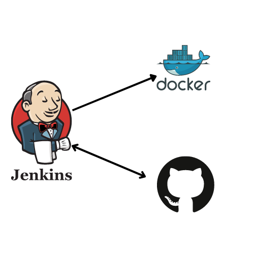

# Run Jenins Server



##  Prerequisites

To run this project, you will need to install 


[`docker`](https://docs.docker.com/engine/install/ubuntu/)

[`docker-compose`](https://docs.docker.com/compose/install/)

## Usage

after installing  Prerequisites run the following command:

#### 
```bash
 ./start-server.sh
```

## Access to Jenkins Server
#### 

 - [localhost:8081](http://localhost:8080/)

## Get password to Start Jenkins Server
```bash
  docker exec -it jenkins bash
  cat /var/jenkins_home/secrets/initialAdminPassword
```
## Customizing Jenkins with plugins 
After unlocking Jenkins, the Customize Jenkins page appears. Here you can install any number of useful plugins as part of your initial setup.
click On Install suggested plugins
 ##  Creating the first administrator user
Finally, after customizing Jenkins with plugins, Jenkins asks you to create your first administrator user.

When the Create First Admin User page appears, specify the details for your administrator user in the respective fields and click Save and Finish.

When the Jenkins is ready page appears, click Start using Jenkins.
## plugin to install insisde docker 
* Docker Pipeline

## Create Acces Token  to acces github 
* You can create a personal access token to use in place of a password with the command line or with the API.[`acces token`](https://github.com/settings/tokens)
* Select the scopes, or permissions, you'd like to grant this token. To use your token to access repositories from the command line, select repo.
* Click Generate token.
* Warning: Treat your tokens like passwords and keep them secret. 
## Add credentails to jenkins 
* go to [`Credentails `](http://localhost:8081/manage/credentials/store/system/domain/_/newCredentials)
* choose for kind Username and password 
* for the section password pass your acces token 
## Create Acces Token  to acces docker hub 
[`acces token`](https://hub.docker.com/settings/security)
after creating the credentails add them into jenkins


## Built With

- Docker
- Jenkins


## Authors
Bendra Abdelali
- [Profile](https://github.com/bendraabdelali)
- [Linkedin](https://www.linkedin.com/in/abdelali-bendra-934755182/)
- [Kaggle](https://www.kaggle.com/bendraabdelali)