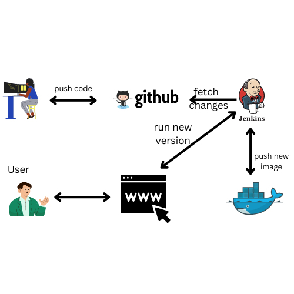
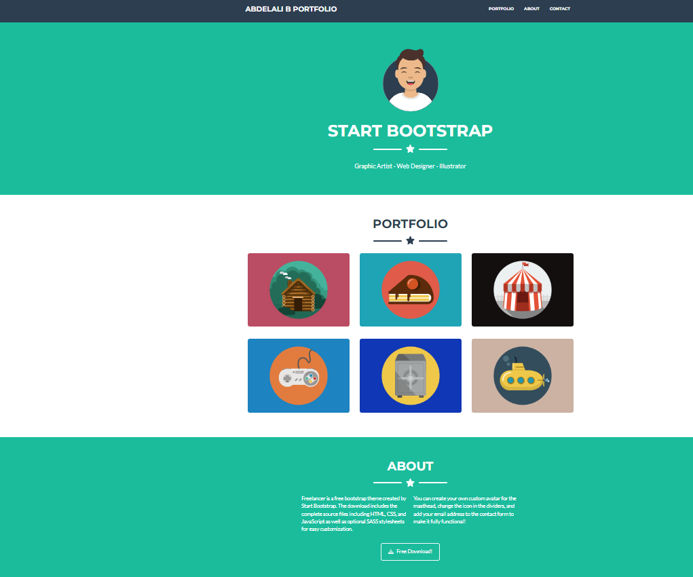
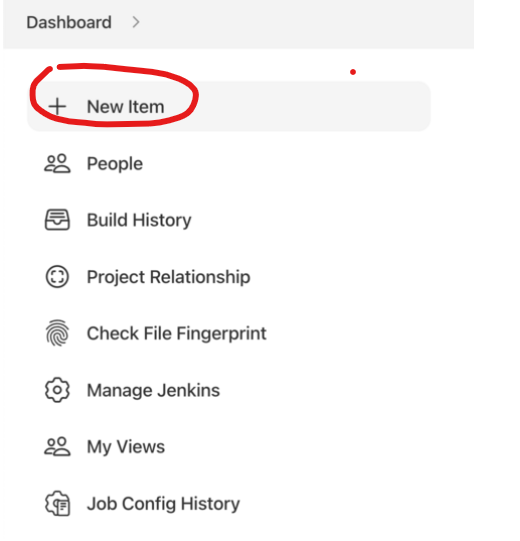

# Docker-portfolio-project

In this project we will crate a complete CI/CD pipline using Jenkins .





##  Prerequisites

To run this project, you will need to install 


[`docker`](https://docs.docker.com/engine/install/ubuntu/)

[`docker-compose`](https://docs.docker.com/compose/install/)


### Install Jenkins Server
to start Jenkins go to Jenkinse Server Folder . [`Server Jenkins`](https://github.com/bendraabdelali/portfolio-docker-nginx-/tree/main/Jenkins%20Server )
## Usage
 ```bash
  docker-compose up -d
```

## Access to portfolio
#### 

 - [localhost:8080](http://localhost:8080/)


### CI/Cd 
## create jenkins Pipeline in Jenkis Server
* create new item 


* Provide a name for your new item (e.g. CI-CD-Pipline) and select  Pipeline
* Choose Pipeline as the job type and click OK.
* Under Pipeline -> Definition choose Pipeline script from SCM.
* Under SCM choose Git.
* Under Repository URL paste the HTTPS URL of your (forked) repository.
* Click Create.
* before click build in the dashboard Jenkins do  some changes into index.html and after that push them into github
* click build now and refresh the page to see the changes 

## Built With

- Docker


## Authors
Bendra Abdelali
- [Profile](https://github.com/bendraabdelali)
- [Linkedin](https://www.linkedin.com/in/abdelali-bendra-934755182/)
- [Kaggle](https://www.kaggle.com/bendraabdelali)